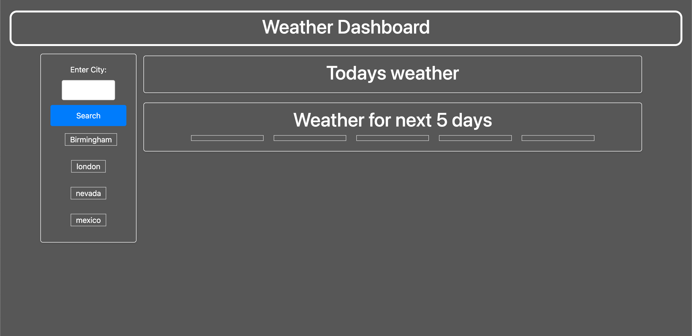
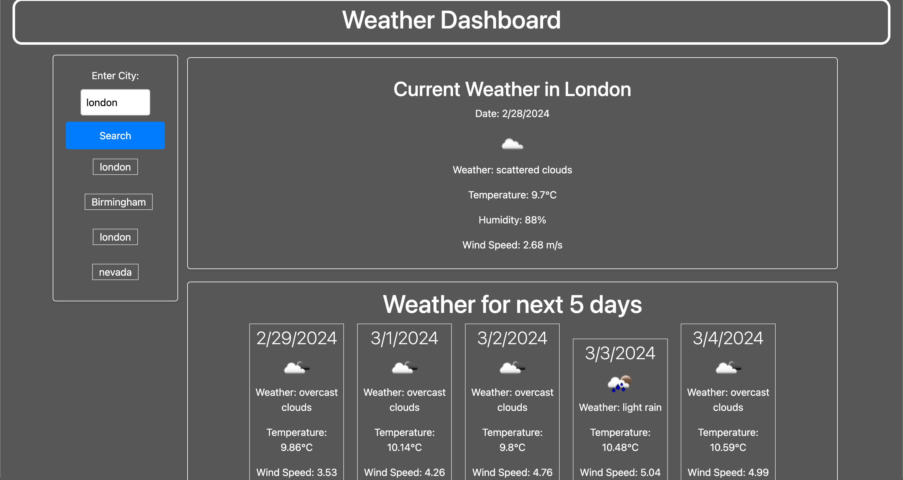

# Weather Dashboard

## Description

- This weather application allows users to check the weather outlook for different cities. It utilizes the OpenWeather API to fetch weather data.

## Motivation

- The motivation behind developing this application was to provide users with a convenient way to access weather information for various locations. The project aimed to showcase the use of server-side APIs, client-side storage, and dynamic content manipulation to create a user-friendly weather dashboard.

## Features

- User-friendly interface for viewing weather information of multiple cities.

- Integration with the OpenWeather API to fetch real-time weather data.

- Persistent storage using localStorage to save user preferences and selected cities.

- Responsive design for seamless user experience on different devices.

- Dynamic updating of weather information based on user interactions.

## Technologies Used

- HTML

- CSS

- JavaScript

- OpenWeather API

## Usage

- Enter the city name in the search bar to view the weather information.

- Save favorite cities for quick access.

- Enjoy real-time weather updates for multiple locations.

## Link

## Screenshots

## Future Development

- Enhance the user interface with more interactive elements.

- Enable users to customize the dashboard layout and themes.

- Integrate geolocation services to automatically detect the user's location for weather updates.

